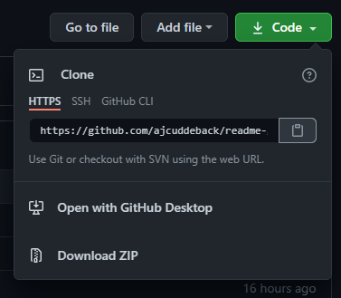
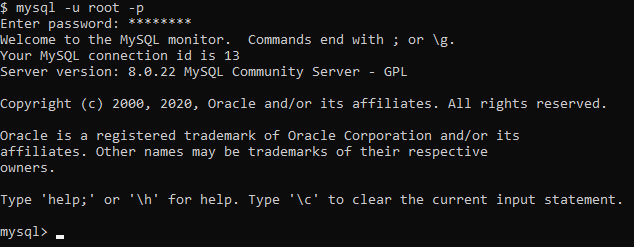
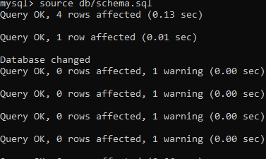
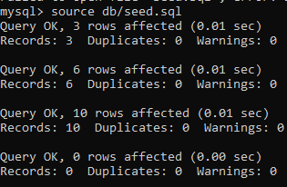
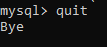
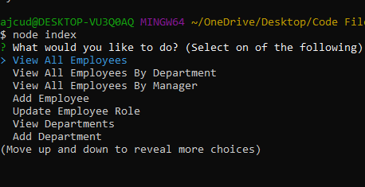
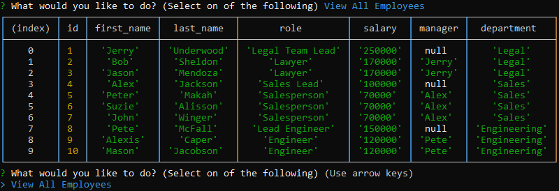

# Employee-tracker

## Description

This project will allow an employer to add and update an employee roster with an easy and simple to use CMS.

## Table of Contents

- [Installation](#installation)
- [Usage](#usage)
- [Instructions](#instructions)
- [License](#license)
- [Questions](#questions)

## Installation

In order to install this project you must clone this project on to your local machine.

## Usage

This project usage is for anyone that needs to organize their employees and departments with a CMS

## Instructions

- If you would like to view a video on how to install and use, go to my [Youtube Channel](https://www.youtube.com/watch?v=TaInk3BLWTI&feature=youtu.be)

- Step 1: Clone this repository

* 

- Step 2: Open the MySQL CLI by typing mysql -u root -p in your bash (Ensure you have MySQL downloaded on your local machine!)

* 

- Step 3: In the MySQL CLI, type 'source db/schema.sql' to populate the database and tables

* 

- Step 4: (Optional) If you would like predefined employees, roles, and departments type 'source db/seed.sql'

* 

- Step 5: Type quit in order to leave the MySQL CLI

* 

- Step 6: Run 'node index' in the terminal while in root directory of the cloned project

* 

- Step 7: Use any of the prompts provided to add or update employees, roles, and departments!

* 

* Step 8: Once you are finished press 'ctrl + C' to exit the program!

## Questions

Created by: [ajcuddeback](https://github.com/ajcuddeback)

If you have any further questions please feel free to contact me at [ajcuddeback@gmail.com](ajcuddeback@gmail.com)
